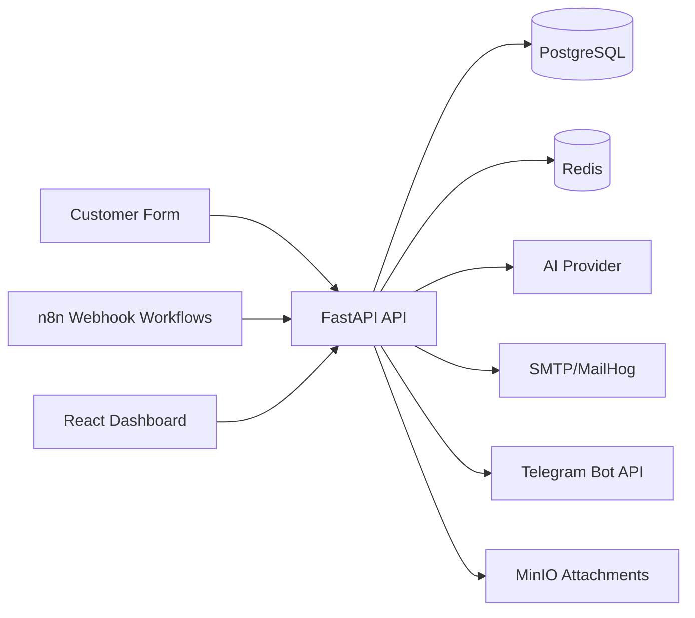
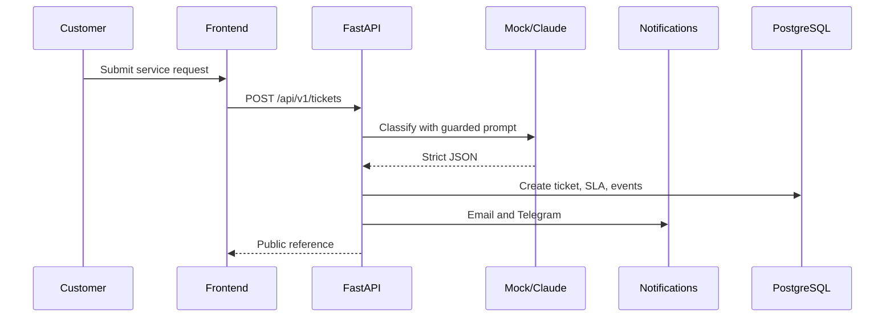

# ServiceFlow AI

ServiceFlow AI is a service request automation platform for technical service companies that repair printers, computers, and office equipment. The system combines a FastAPI backend, n8n workflow orchestration, AI-assisted request classification, email and Telegram notifications, PostgreSQL persistence, Redis-ready infrastructure, and a React administrator dashboard.

## Business Problem

Service requests often arrive as unstructured text with missing priority, unclear routing, duplicate submissions, and no consistent audit trail. This project turns each request into a traceable ticket with validated AI output, SLA assignment, notification history, and manual review when confidence is low.

## Capabilities

- Public service request form with client-side and API-side validation.
- AI classification through Anthropic, an OpenAI-compatible fallback, or a deterministic local mock provider.
- Strict schema validation for every AI classification result before it affects ticket state.
- Duplicate detection and idempotent ticket creation.
- Manual review queue for low-confidence or failed classification.
- SMTP email flow with MailHog for local testing.
- Optional Telegram Bot API notification support.
- MinIO-backed attachment storage integration.
- JWT-protected administrator dashboard and versioned REST API.
- Structured JSON logs, request IDs, HMAC validation, health checks, and readiness checks.

## Technology Stack

Python 3.12, FastAPI, Pydantic v2, SQLAlchemy 2 async, Alembic, PostgreSQL 16, Redis, React, TypeScript, Vite, TanStack Query, React Hook Form, Zod, Docker Compose, n8n, MailHog, MinIO, GitHub Actions.

## Architecture



## Workflow



## Local Installation

```bash
cp .env.example .env
docker compose up --build
```

Open:

- Frontend: http://localhost
- API docs: http://localhost:8000/docs
- MailHog: http://localhost:8025
- n8n: http://localhost:5678
- MinIO console: http://localhost:9001

## Demo Login

Email: `admin@serviceflow.local`
Password: `Admin123!ChangeMe`

These are development defaults only and are loaded from `.env`.

## API Examples

```bash
curl -X POST http://localhost:8000/api/v1/tickets \
  -H "content-type: application/json" \
  -d '{"customer_name":"Anna Kowalska","customer_email":"anna@example.com","device_type":"printer","device_model":"HP LaserJet","description":"The printer does not print, displays a toner error, and is urgently needed for university administration."}'
```

## Testing

```bash
cd backend && pytest
cd frontend && npm install && npm test -- --run
docker compose config
```

The mock AI provider is the default for local development and automated tests.

## Engineering Decisions and Trade-offs

- n8n is used for orchestration because webhook routing, retries, operational visibility, and low-code integration are strengths of workflow tools.
- FastAPI contains core business logic because ticket creation, idempotency, security, and audit events must be versioned and tested as application code.
- AI output is treated as untrusted input and validated with Pydantic before it can affect ticket state.
- Low-confidence results require manual review because incorrect automation is more expensive than a short human checkpoint.
- Idempotency comes from duplicate detection using customer, device, normalized description, and a configurable time window.
- AWS deployment could use ECS or EKS, RDS PostgreSQL, ElastiCache Redis, S3 instead of MinIO, Secrets Manager, CloudWatch, and an Application Load Balancer.

## Environment

Required: `DATABASE_URL`, `REDIS_URL`, `JWT_SECRET_KEY`, `ADMIN_EMAIL`, `ADMIN_PASSWORD`, `N8N_WEBHOOK_SECRET`, SMTP settings, and MinIO settings.

Optional: `ANTHROPIC_API_KEY`, `OPENAI_COMPATIBLE_API_KEY`, `OPENAI_COMPATIBLE_BASE_URL`, `TELEGRAM_BOT_TOKEN`, `TELEGRAM_CHAT_ID`.

## Future Improvements

Planned improvements include direct S3 object upload streaming, background notification workers, richer role permissions, OpenTelemetry traces, full Playwright end-to-end tests, and production deployment manifests.
